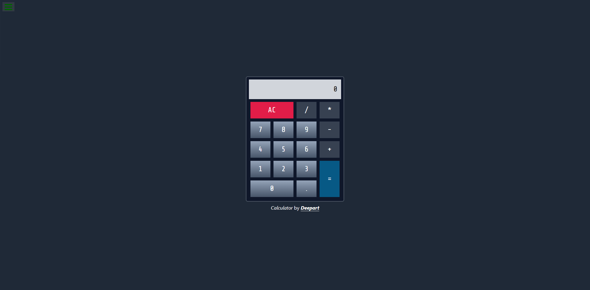

# JavaScript Calculator

A responsive calculator application built as part of the **freeCodeCamp Front End Development Libraries** certification. The calculator performs basic arithmetic operations while following the required project specifications.

## 📸 Preview

## ✨ Features

- Basic arithmetic operations
- Keyboard-friendly interface
- Responsive design
- Expression evaluation
- Meets all freeCodeCamp project requirements

## 🛠 Tech Stack

- React
- JavaScript
- HTML5
- CSS3

## 🚀 Live Demo

https://bluedeepart.github.io/javascript-calculator/

## 📄 License

This project was developed for educational purposes as part of the freeCodeCamp curriculum.
